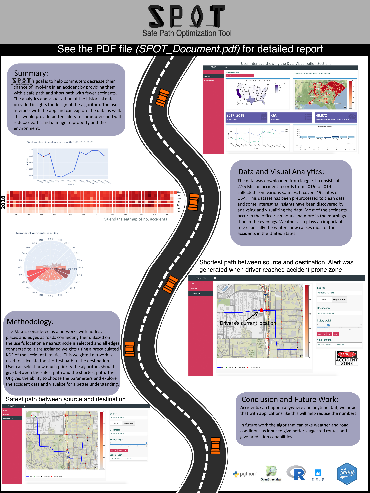

# SPOT (Safe Path Optimisation Tool)

This is an application built on R, R shiny and Python to help the commuters and drivers by decreasing their chance of accidents. This app provides following features:

* Visualize the historic accidents through different maps, plots, and trends
* Find an optimal path between the user's current location (or entered source) and destination. 
* User can give different weights to parameters like safety from accidents or length. The app will find the path which minimizes the following overall cost

   C<sub>total</sub> = &alpha;C<sub>accident_risk</sub> + (1-&alpha;)C<sub>length</sub>x
   
   where &alpha; is the weight given to safety from road accidents
* Alerts user when he reaches close to an accident-prone zone

## Installation
To install this make sure the 'devtools' package is installed. To install devtools
```R
install.packages("devtools")
```
After successful installation, run following commands
```R
library(devtools)
install_github("apurvpriyam/SPOT")
```

Before running the app, its recommended to see the help by running the command 
```R
?runSPOT
```
To run the app, type the command on R console
```R
runSPOT()
```

## See the document for more information (SPOT_Document.pdf)
https://github.com/apurvpriyam/SPOT/blob/master/SPOT_document.pdf


